# Зеркальное Отражение: Решение

В данном уроке мы рассмотрим построение вид сверху детали, используя зеркальное отражение. Задача заключается в пошаговом создании эскиза, который является симметричным относительно вертикальной и горизонтальной осей.

## Задание

**Постройте вид сверху, включающий в себя различные геометрические элементы.**

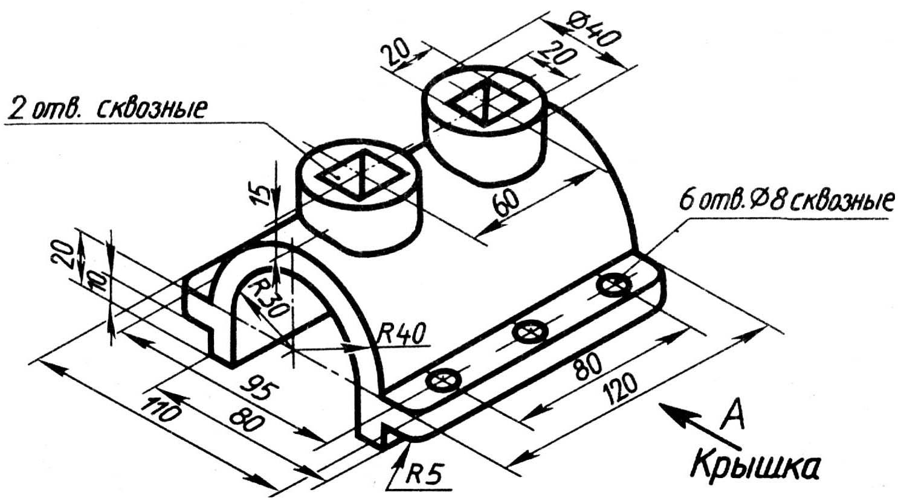

## Решение

1. **Выбор плоскости:** Начнем с выбора ортогональной плоскости XY для создания эскиза.

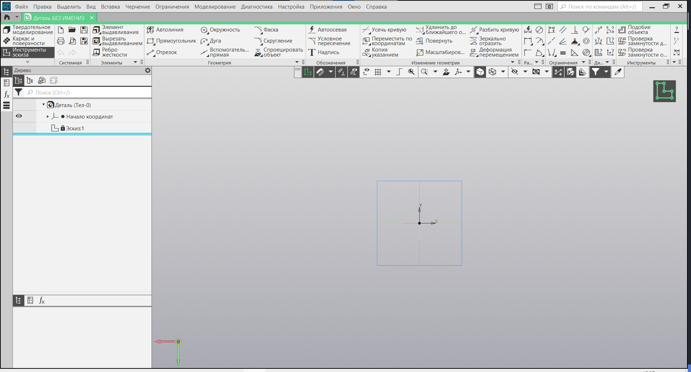

2. **Основание детали:** Используя команды "Прямоугольник" и "Параллельный отрезок," создадим основание детали.

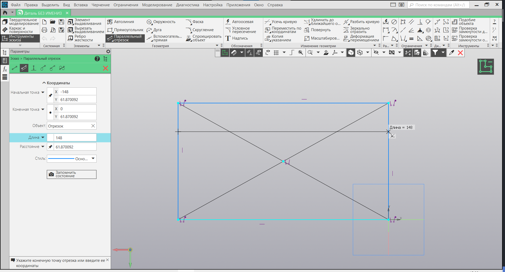

3. **Уточнение геометрии:** Удалим диаметры у прямоугольника и заменим некоторые стороны на осевые линии для большей наглядности.

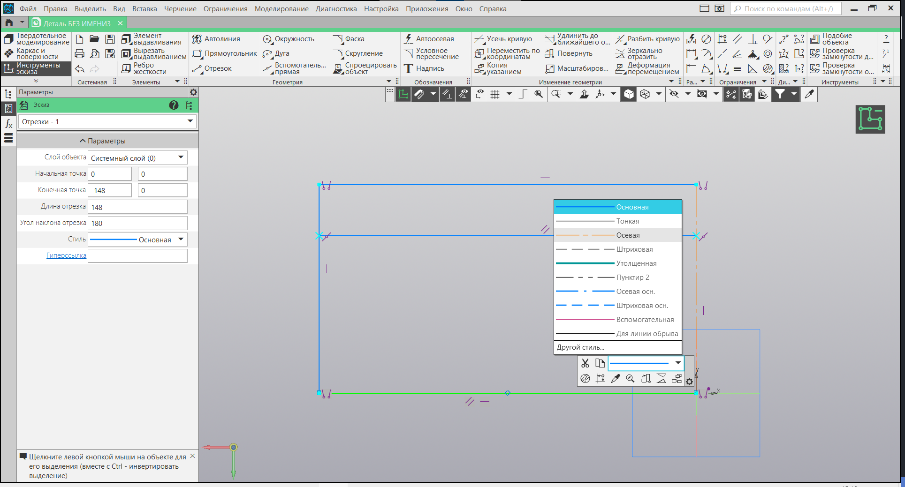

4. **Скругление основания:** Добавим скругление для основания, используя команду "Скругление".

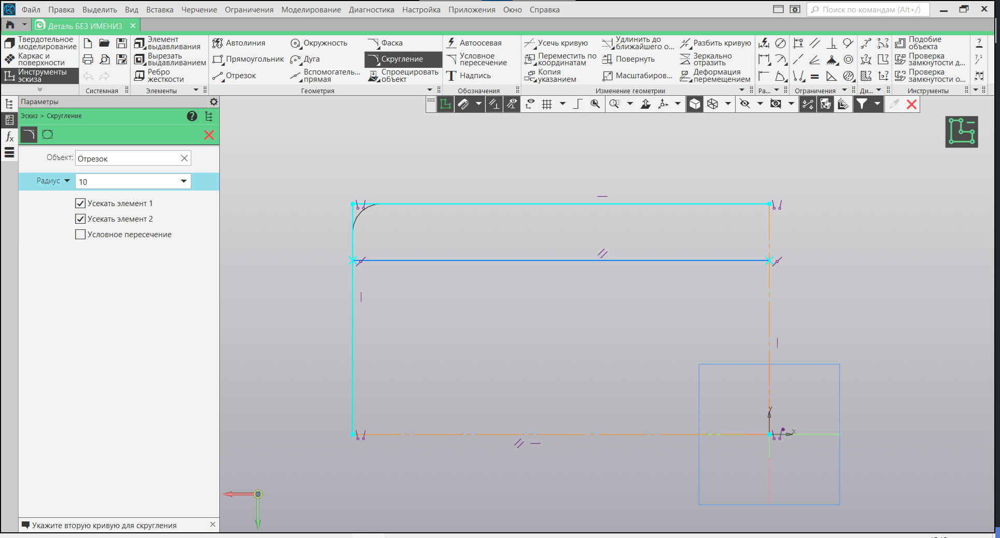

5. **Вспомогательная прямая:** Добавим вспомогательную прямую для отверстий в основание с помощью команды "Горизонтальная прямая".

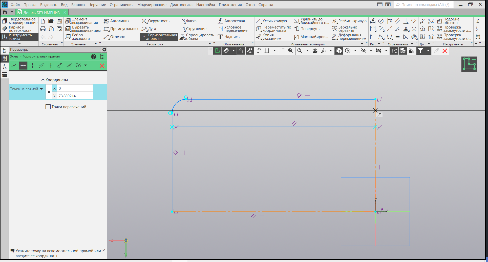

6. **Отверстия в основании:** Добавим отверстие с помощью команды "Окружность".

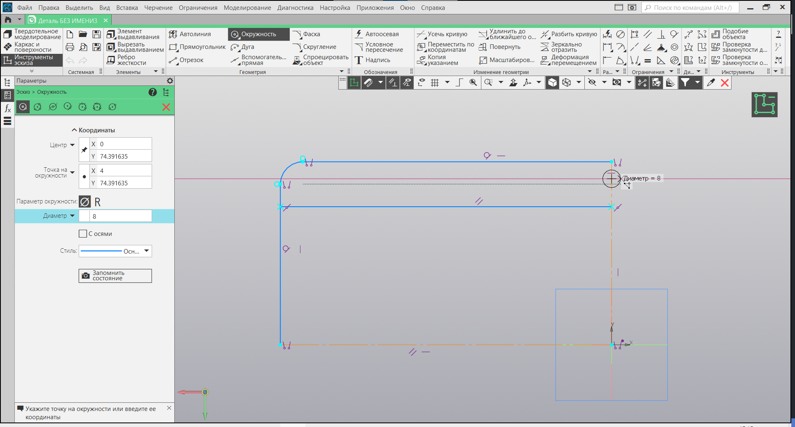

7. **Копирование по кривой:** С помощью команды "Копия по кривой" создадим копии отверстий, сделав их равномерно распределенными.

8. **Зеркальное отражение по вертикали:** Сделаем зеркальное отражение части эскиза по вертикали, чтобы создать симметрию.

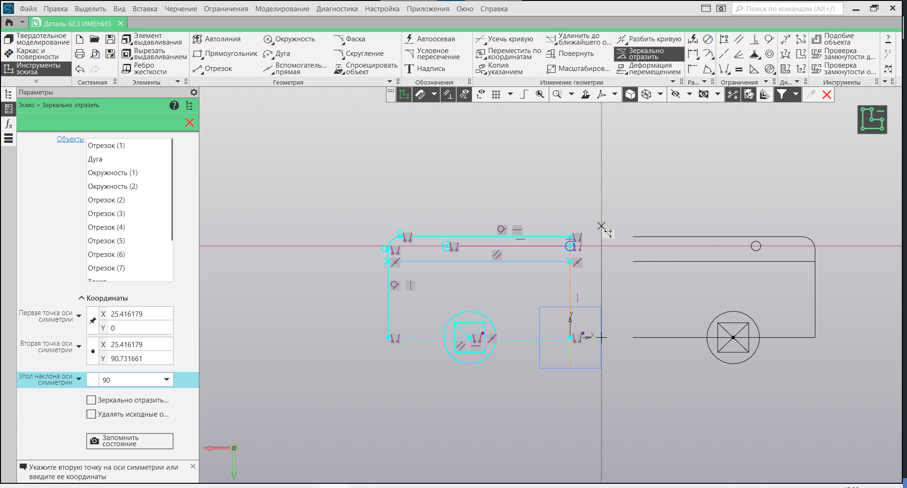

9. **Привязка точек и линий:** Привяжем точки и линии для создания стабильной структуры. Используем команды "Объединить точки", "Равенство", "Точка на кривой", "Симметрия двух точек".

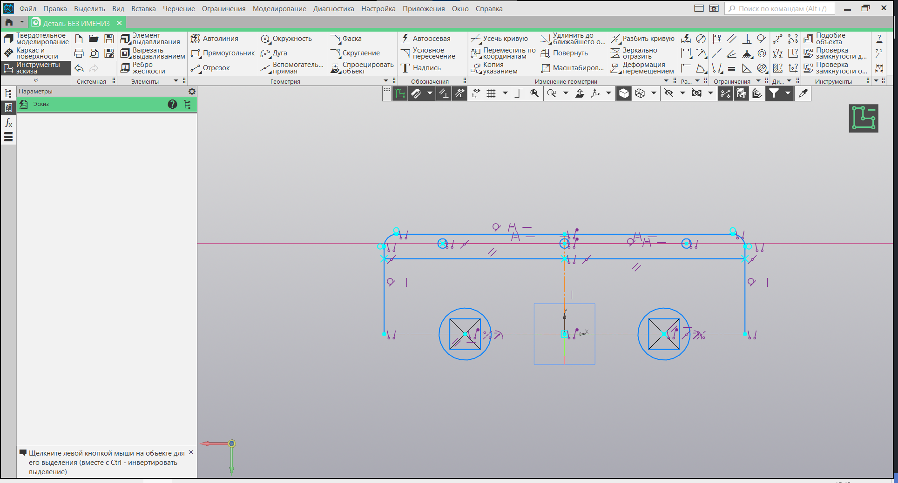

10. **Зеркальное отражение по горизонтали:** Повторим операцию зеркального отражения, но уже по горизонтали.

11. **Привязка точек и линий второй части:** Привяжем точки и линии второй части эскиза так, чтобы они симметрично соответствовали первой. Используем те же команды для привязки.

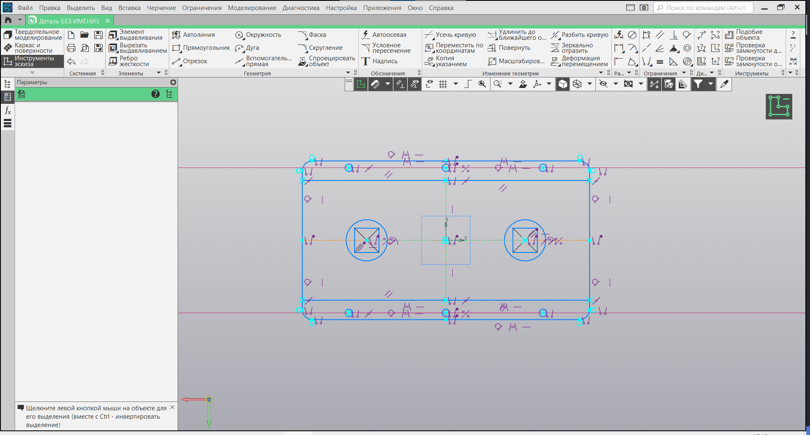

12. **Задание размеров:** Зададим размеры для окончательной формы нашего эскиза.

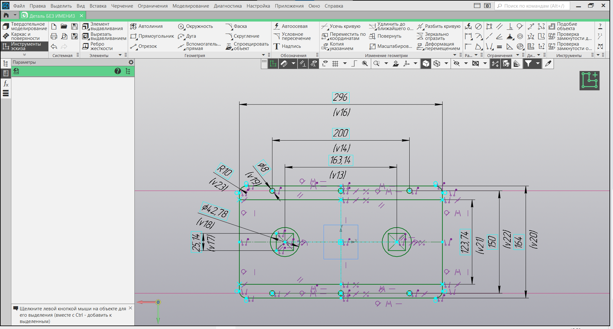

13. **Реальные размеры через таблицу параметров:** Зададим реальные размеры эскиза, используя таблицу параметров.

## Заключение

Этот урок демонстрирует процесс построения сложного эскиза с использованием зеркального отражения. Экспериментируйте с инструментами и привязками, чтобы лучше понять возможности программы. Практика и творчество важны для совершенствования навыков.
