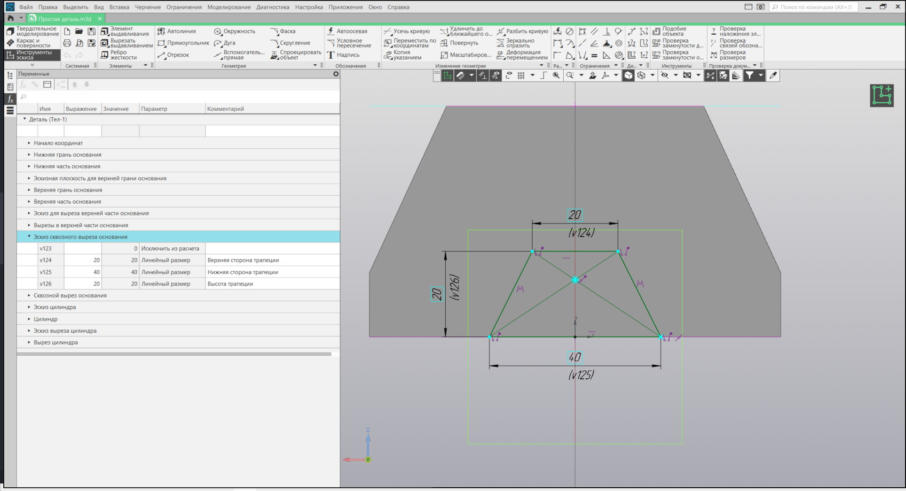

# Простая деталь

Добро пожаловать в урок по созданию простой детали в программе КОМПАС-3D! В этом уроке мы рассмотрим процесс пошагового моделирования детали, включая различные элементы, которые придают ей форму и структуру. Полученные знания станут вашей основой для создания базовых деталей в мире КОМПАС-3D. Давайте начнем это увлекательное путешествие в создание трехмерных объектов!

## Задание

## Решение

### 1. Эскиз нижней грани

Начнем с создания эскиза для нижней грани без вырезов. Воспользуйтесь необходимыми инструментами и не забудьте дать название эскизу в дереве детали для удобства.

_Примечание:_ Вы можете также давать названия элементам детали, нажимая на них в дереве и используя раздел "Параметры" для указания собственных названий.

### 2. Нижняя часть основания

Используя команду "Элемент выдавливания", создайте нижнюю часть основания.

### 3. Смещенная плоскость для верхней грани

Создайте эскизную плоскость для верхней грани основания с помощью команды "Смещенная плоскость".

### 4. Эскиз верхней грани основания

Создайте эскиз для верхней грани основания без вырезов.

### 5. Верхняя часть основания

С помощью команды "Элемент по сечениям" сформируйте верхнюю часть основания.

### 6. Эскиз для выреза верхней части

Создайте эскиз для выреза верхней части основания.

### 7. Вырез верхней части

Используя команду "Элементы выдавливания", выполните вырез верхней части основания.

### 8. Эскиз сквозного выреза

Создайте эскиз для сквозного выреза в основании.

### 9. Сквозной вырез в основании

С помощью команды "Элемент выдавливания" выполните сквозной вырез в основании.

### 10. Эскиз цилиндрической части

Сделайте эскиз для цилиндрической части детали.

### 11. Цилиндрическая часть детали

Используя команду "Элемент выдавливания", создайте цилиндрическую часть детали.

### 12. Эскиз для выреза в цилиндрической части

Создайте эскиз для выреза в цилиндрической части детали.

### 13. Вырез в цилиндрической части

С помощью команды "Элементы выдавливания" выполните вырез в цилиндрической части.

### 14. Наименования и комментарии

Дайте элементам дерева детали названия.

Оставьте комментарии для переменных в таблице "Переменные" и задайте им реальные размеры.

### 15. Задайте размеры детали

Теперь, когда мы построили деталь, важно задать ей размеры для определения ее точных параметров. Воспользуемся командой "Производные размеры". Выберем элемент детали в дереве конструктора, чьи размеры мы хотим отобразить. Если не устраивает расположение размерной линии или плоскости, можно легко изменить их при помощи команды "Разместить производные размеры".

Добавление размеров поможет нам не только визуализировать параметры детали, но и предоставит удобный способ быстрого изменения размеров при необходимости.

### 16. Пересборка детали

Пересоберите деталь после изменения значений.

Вы также можете пересобрать деталь на "Панели вида".

## Заключение

Поздравляю! Вы успешно создали простую деталь, используя различные инструменты КОМПАС-3D. Этот процесс дал вам понимание основных шагов в создании сложных трехмерных объектов. Успехов в вашем дальнейшем моделировании!
